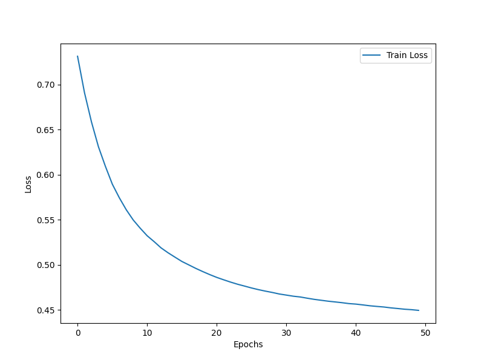
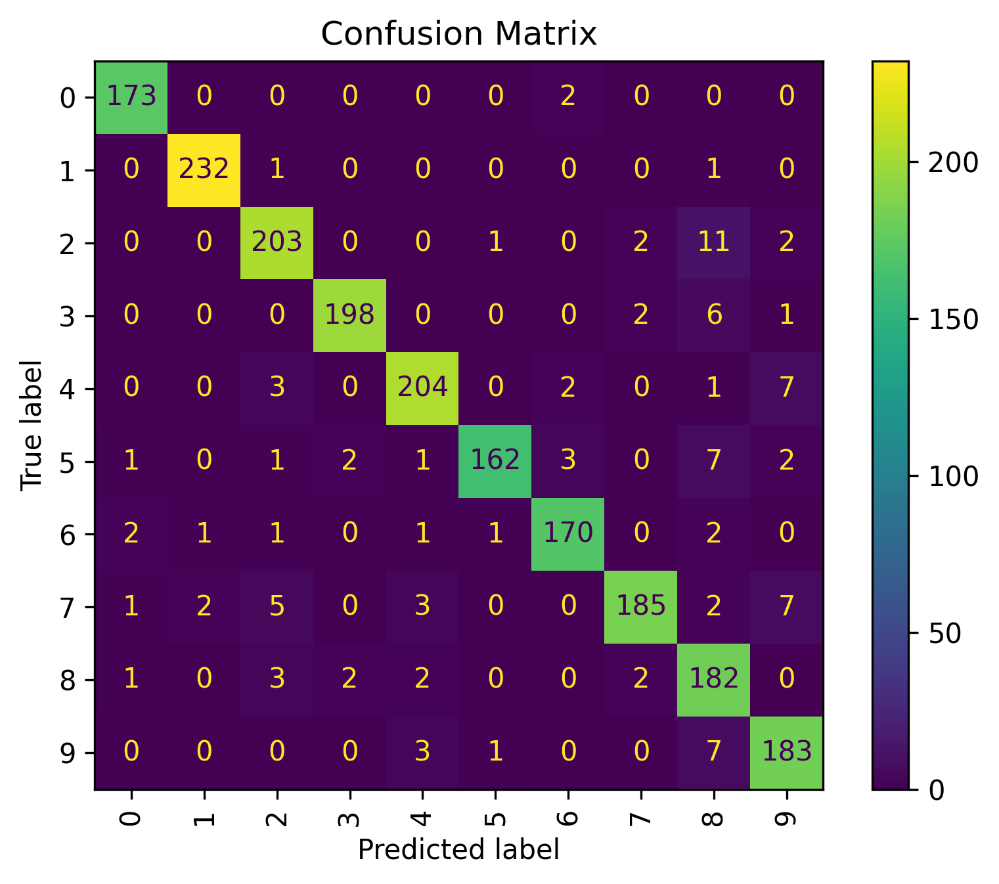

# **Deep Learning Projects**

<p align="center">
  
</p>  

*A collection of deep learning projects demonstrating practical applications of neural networks.*

---

## 📚 **Overview**

This repository contains various deep learning projects built using **TensorFlow** and **Keras**. Each project focuses on solving a real-world problem, complete with data preprocessing, model design, training, evaluation, and visualizations. Whether you're learning or showcasing skills, this repository is a valuable resource.

---

## 📂 **Projects Included**

### 1. **Diabetes Prediction Using Neural Networks**
   - **Goal**: Predict whether an individual has diabetes based on medical features.
   - **Dataset**: Pima Indians Diabetes Dataset.
   - **Highlights**:
     - Data normalization and preprocessing.
     - ReLU and sigmoid activation functions.
     - Training and evaluating a binary classification model.
   - **Results**:  
     <p align="center">
       
     </p>  
     *Training and validation accuracy over epochs.*

### 2. **Handwritten Digit Recognition**
   - **Goal**: Classify handwritten digits from the `MNIST` dataset.
   - **Dataset**: `tensorflow.keras.datasets.mnist` dataset.
   - **Highlights**:
     - Image normalization and reshaping.
     - Multi-class classification with softmax activation.
     - Visualizing predictions and performance metrics.
   - **Results**:  
     <p align="center">
       
     </p>  
     *Example of correctly classified digits.*

---

## 🛠 **Installation and Setup**

1. Clone the repository:
   ```bash
   git clone https://github.com/yourusername/Deep_Learning_Projects.git
   cd Deep_Learning_Projects
   ```

2. Install the required dependencies:
   ```bash
   pip install -r requirements.txt
   ```

3. Navigate to a project folder and open the notebook:
   ```bash
   cd Diabetes_Prediction
   jupyter notebook
   ```

---

## 📊 **Project Structure**

```
Deep_Learning_Projects/
│
├── Diabetes_Prediction/
│   ├── diabetes_prediction.ipynb
│   ├── dataset.csv
│   └── results/
│       ├── accuracy.png
│       └── loss.png
│
├── Handwritten_Digit_Recognition/
│   ├── digit_recognition.ipynb
│   ├── digits_dataset.csv
│   └── results/
│       ├── sample_digits.png
│       └── performance_metrics.png
│
├── requirements.txt
└── README.md
```

---

## 🎯 **Goals of the Repository**

- Learn the basics of deep learning with practical, hands-on projects.
- Implement and train neural networks for real-world datasets.
- Build a portfolio of machine learning projects to showcase your skills.

---

## 🤝 **Contributing**

Contributions are welcome! Feel free to fork this repository, add new projects, or improve existing ones. Submit a pull request, and let’s collaborate.

---

## 📧 **Contact**

For questions or suggestions, feel free to reach out:  
**Aymane Rihane**  
[rihaneaymanee@gmail.com] | [www.linkedin.com/in/aymane-rihane](#)
